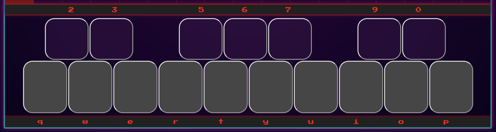

# Beat-Box
A music making toy featuring a drum-machine, a sequencer, and a playable piano.

# About
Beat-box has two instruments, a **Drum Machine:**

And a **Sequencer** with a playable keyboard.

# Drum-Machine
The drum machine has four sections to help you make a beat. 

The **Display** shows the current count.

The **Tempo Selector** allows you to speed up or slowdown the count (the tempo selector also controls the tempo for the sequencer). The cyan border shows you which tempo option is currently selected. The tempo can be changed while the loop is running or while stopped.

The drum machine **Pads** have five sounds that will play when selected. You can enable a sound by clicking on one of the pads. When you click on the pad you will see it light up green to let you know you have enabled the instrument on that beat. The sounds available on the drum machine are:

- **Row 1:** Bass drum
- **Row 2:** Snare drum
- **Row 3:** Hi-hat
- **Row 4:** Clap
- **Row 5:** Cowbell

The last row of the drum machine is a **Step Selector** that allows you to set the length of the drum loop. The changes can be made while the loop is running or while it has been stopped.

To start the drum machine loop (and sequencer) click on the **START/STOP** button.

# Sequencer
To switch to the sequencer, click on the image of the sequencer. This can be done without stopping the drum-machine. The drum-machine will continue playing in the background if you have created a beat.

The sequencer has two sections.

The **Sequence Grid** allows you to select which notes you would like to play at a particular beat. All you have to do is click on a cell. 

The **Keyboard** section can be used by clicking on the keys with a mouse or by typing using the labeled keys (key labels disappear when on a mobile device, but can still be clicked on).

# Tips
- You don’t have to worry about accidentally hitting refresh. The drum machine and sequencer will remember your selections.

- To enable the metronome you can click on the **CLICK TRACK** button. You can use the metronome to help you create a sequence on the sequencer without a drum machine beat.

- The step selector can be used to separate two beats. If you were two select the eighth step everything beyond the eighth beat could be used as a fill, and enabled live.

- Musical typing works regardless of whether the sequencer is selected.

- Always use in landscape mode, the page will ask you to rotate your device if you are in portrait mode.
